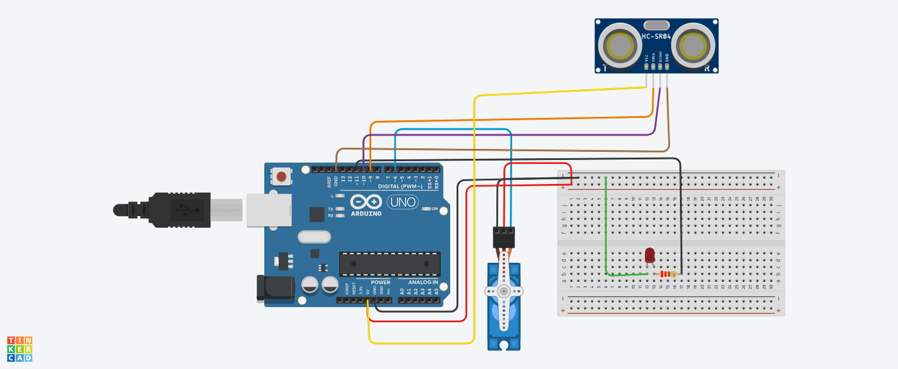

# Introdução

Este projeto utiliza um Arduino Uno conectado a um Sensor Ultrassônico, um LED e um Servo Motor para criar um sistema de detecção de obstáculos. 
O sistema mede a distância até um objeto usando o sensor ultrassônico e, se a distância for menor que um limite definido, acende o LED e move o servo motor.
A implementação inclui a montagem dos componentes em uma protoboard e pode ser expandida para incluir outros sensores ou atuadores.

# Componentes Usados

Arduino Uno – Microcontrolador utilizado para controlar o sistema.
Sensor Ultrassônico (HC-SR04) – Utilizado para medir a distância até um objeto.
LED – Acende quando um objeto é detectado dentro do limite de distância.
Servo Motor – Movimenta-se quando um objeto é detectado dentro do limite de distância.
Protoboard – Utilizada para montar o circuito de forma temporária e sem a necessidade de solda.
Jumpers Macho-Macho – Cabos de conexão para ligar os componentes ao Arduino e entre si.

# Montagem do Circuito

# Explicação do Código

#include <Servo.h>

// Definindo os pinos
const int trigPin = 9;
const int echoPin = 10;
const int ledPin = 11;
const int servoPin = 6;

// Criação do objeto Servo
Servo myServo;

// Distância mínima para detecção (em cm)
const int distanceThreshold = 60; // Ajustado para 30 cm

void setup() {
  Serial.begin(9600);
  
  // Configurando os pinos
  pinMode(trigPin, OUTPUT);
  pinMode(echoPin, INPUT);
  pinMode(ledPin, OUTPUT);
  
  // Inicializando o servo
  myServo.attach(servoPin);
  myServo.write(90); // posição inicial do servo
}

void loop() {
  long duration, distance;

  // Enviar um pulso de 10us para o sensor
  digitalWrite(trigPin, LOW);
  delayMicroseconds(2);
  digitalWrite(trigPin, HIGH);
  delayMicroseconds(10);
  digitalWrite(trigPin, LOW);
  
  // Ler o tempo do pulso
  duration = pulseIn(echoPin, HIGH);
  
  // Calcular a distância
  distance = (duration * 0.034) / 2; // cm

  // Exibir a distância no Serial Monitor
  Serial.print("Distância: ");
  Serial.print(distance);
  Serial.println(" cm");

  // Verificar se a distância é menor que o limite
  if (distance < distanceThreshold) {
    // Acender o LED
    digitalWrite(ledPin, HIGH);
    
  // Girar o servo para desviar
    myServo.write(180); // ajustar o ângulo conforme necessário
    delay(1000); // espera para o servo mover
    
   // Voltar o servo para a posição original
    myServo.write(90); // posição inicial
    delay(1000); // espera para o servo voltar
    
  // Desligar o LED
    digitalWrite(ledPin, LOW);
  } else {
    // Desligar o LED se não houver obstáculos
    digitalWrite(ledPin, LOW);
  }

  delay(100); // aguardar um pouco antes da próxima medição
}

# Definição das Variáveis

trigPin: Pino conectado ao pino de trigger do sensor ultrassônico.
echoPin: Pino conectado ao pino de echo do sensor ultrassônico.
ledPin: Pino conectado ao LED.
servoPin: Pino conectado ao servo motor.
distanceThreshold: Distância mínima para detecção (em cm).
duration: Tempo de duração do pulso ultrassônico.
distance: Distância calculada com base no tempo do pulso.

# Funções Principais
setup(): Configura os pinos do sensor ultrassônico, LED e servo motor como saída e entrada, respectivamente.
loop(): Envia um pulso ultrassônico, calcula a distância até um objeto e, se a distância for menor que o limite, acende o LED e move o servo motor. Caso contrário, o LED permanece apagado.
