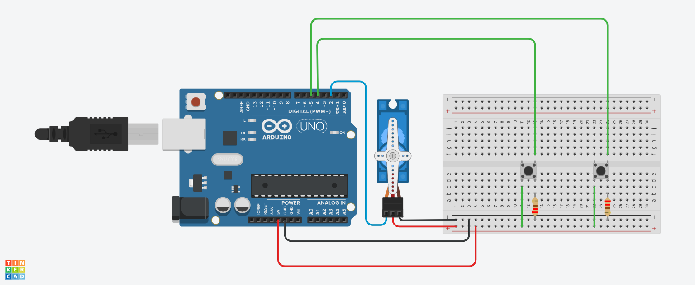

# Introdução

Este projeto utiliza um Arduino Uno conectado a um Sensor PIR, um Buzzer Piezoelétrico e um Servo Motor para criar um sistema de detecção de presença com sinalização sonora e movimento. 
O sistema detecta movimento através do sensor PIR, emite um som pelo buzzer e movimenta o servo motor, permitindo a sinalização sonora e visual quando há movimento. A implementação inclui a
montagem dos componentes em uma protoboard e pode ser expandida para incluir outros sensores ou atuadores.

# Componentes Usados

- Arduino Uno – Microcontrolador utilizado para controlar o sistema.
- Sensor PIR (Passive Infrared Sensor) – Responsável por detectar movimento ao captar mudanças na radiação infravermelha.
- Buzzer Piezoelétrico – Dispositivo que emite som quando ativado, utilizado para sinalização sonora quando o sensor detecta movimento.
- Servo Motor – Utilizado para criar movimento em resposta à detecção de presença.
- Protoboard – Utilizada para montar o circuito de forma temporária e sem a necessidade de solda.
- Jumpers Macho-Macho – Cabos de conexão para ligar os componentes ao Arduino e entre si.

# Montagem do Circuito

# Explicação do Código

#include <Servo.h>

// criando objeto do tipo servo Motor
Servo objetoservo;

// variável para salvar a porta que o servo está
int servo = 2;

// variáveis para as portas dos botões
int butaoAvancar = 4;  // botão para avançar
int butaoRecuar = 5;   // botão para recuar

// variável para posição do motor
int posicao = 0;

int sensorPIR = 3;
int buzzer = 5;

void setup() {
  // inicializando o servo na porta digital 2
  objetoservo.attach(servo);
 
  // servo começa na posição zero
  objetoservo.write(posicao);
 
  // definir botões como entrada
  pinMode(butaoAvancar, INPUT);
  pinMode(butaoRecuar, INPUT);
  
  pinMode(sensorPIR, INPUT);
  pinMode(buzzer, OUTPUT);
}

void loop() {
  // Se o botão de avançar for pressionado e a posição do servo estiver menor que 180
  if (digitalRead(butaoAvancar) == HIGH && posicao < 180) {
    // Aumente 1° de posição
    posicao++;
    // Mande o motor para a nova posição
    objetoservo.write(posicao);
    // Aguarde 1 segundo para a próxima leitura
    delay(1000);
  }

  // Se o botão de recuar for pressionado e a posição do servo estiver maior que 0
  if (digitalRead(butaoRecuar) == HIGH && posicao > 0) {
    // Diminua 1° de posição
    posicao--;
    // Mande o motor para a nova posição
    objetoservo.write(posicao);
    // Aguarde 1 segundo para a próxima leitura
    delay(1000);
  }
  
  int detectarPresenca = digitalRead(sensorPIR);
  if (detectarPresenca == 1) {
    tone(buzzer, 264);
  } else {
    noTone(buzzer);
  }
}

# Definição das Variáveis

buzzer: Pino conectado ao buzzer para emitir som.
sensorPIR: Pino conectado ao sensor PIR para detecção de movimento.
detectarPresenca: Variável que guarda o estado atual do sensor (detectando ou não movimento).
servo: Pino conectado ao servo motor.
butaoAvancar: Pino conectado ao botão para avançar a posição do servo.
butaoRecuar: Pino conectado ao botão para recuar a posição do servo.
posicao: Variável que guarda a posição atual do servo motor.

# Funções Principais
setup(): Configura os pinos do buzzer, sensor PIR, servo motor e botões como saída e entrada, respectivamente.
loop(): Verifica o estado do sensor PIR e, caso detecte movimento, aciona o buzzer. Quando não há movimento, o buzzer é desligado.
Além disso, verifica os botões para avançar ou recuar a posição do servo motor.
