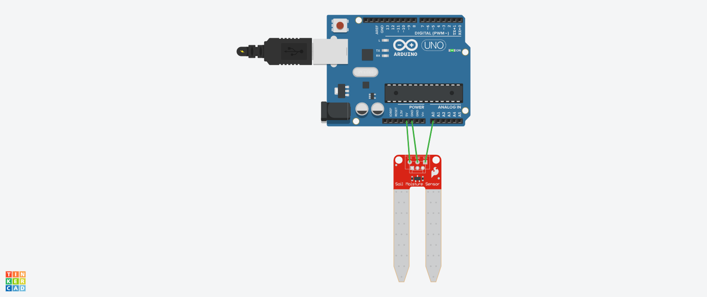

# Projeto: Sensor de Umidade do Solo com Arduino Uno
Este projeto utiliza um Arduino Uno conectado a um sensor de umidade do solo.
O objetivo é monitorar os níveis de umidade no solo e utilizá-los para aplicações como automação de irrigação em jardins ou controle de condições ambientais em estufas.
O sistema coleta dados do sensor de umidade e pode ser configurado para acionar alarmes ou sistemas de irrigação quando os níveis de umidade atingirem valores específicos.
Este projeto é ideal para aplicações agrícolas, jardinagem automatizada e sistemas de monitoramento de solo.

## Componentes Usados

- 1 Arduino Uno
- 1 Sensor de Umidade do Solo
- 2 Jumpers Macho-Fêmea (conexões de alimentação e leitura)
- 1 Cabo USB para programação e alimentação do Arduino

## Montagem do Circuito

## Explicação do Código

// Biblioteca para conexão serial do sensor
#include <SoftwareSerial.h>

// Variável do sensor
int sensor = A0;

void setup() {
  // Definir o sensor como entrada
  pinMode(sensor, INPUT);
  // Utilizando o monitor serial
  Serial.begin(9600);
}

void loop() {
  // Guardar o valor lido pelo sensor
  int umidade = analogRead(sensor);
 
  // Imprimindo o valor lido
  Serial.print("Umidade do solo: ");  
  Serial.println(umidade);
 
  // Classificação da umidade do solo
  if (umidade >= 0 && umidade <= 300) {
    Serial.println("Solo seco");
  } else if (umidade > 300 && umidade <= 500) {
    Serial.println("Solo ideal");
  } else if (umidade > 500) {
    Serial.println("Solo úmido");
  }

  delay(10000); // Espera 10 segundos
}

## Definição das Variáveis

sensorPin: Define o pino analógico A0 do Arduino como o ponto de leitura para o sensor de umidade.
sensorValue: Armazena o valor lido do sensor de umidade, que será exibido no monitor serial.

## Funções Principais

setup(): Configura a taxa de comunicação serial para 9600 bps e inicializa a leitura dos dados do sensor.
loop(): Lê os valores de umidade a cada 1 segundo e exibe no monitor serial. Esses valores podem ser usados para tomar decisões automatizadas, como ligar um sistema de irrigação.
