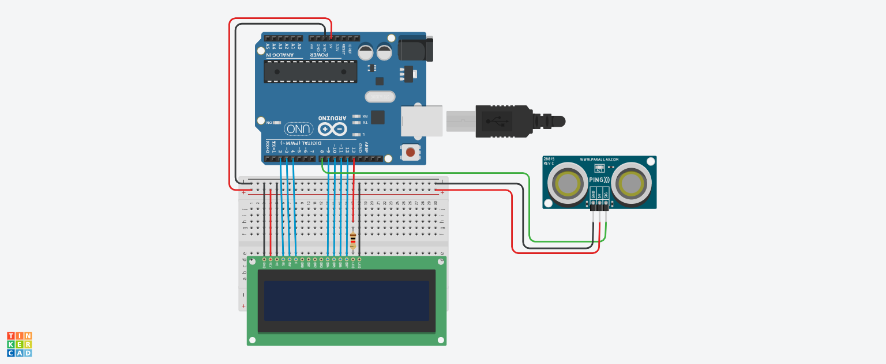

# Projeto de tela lCD com sensor de Distância

este projeto foi desenvolvido dentro do tinkiercad, na disciplina de Internet das Coisas(IOT), para a criação de um arduino que simule uma mensagem de mantenha 
distância toda vez que alguém se aproxime a menos de 1 metro do sensor.

## Coomponentes Usados 

- 1 Arduino Uno
- 1 Placa de Ensaio
- 1 sensor de Distância
- 1 Tela LCD 16X2
- 14 Jumpers Machor-Macho
- 3 Jumpers Macho-Fémea
- 1 Resistor de 1 KOhms

## Montagem do Circuito

.

## Explicação do Código

Importando a biblioteca do LCD.
#incluide <LiquidCrystal.h>

 Incluir a biblioteca para o controle do LCD
#include <LiquidCrystal.h>

Configuração do LCD, definindo os pinos do Arduino conectados ao display
LiquidCrystal lcd(2, 3, 4, 9, 10, 11);

Definição dos pinos do LED e do sensor ultrassônico
int ledLcd = 13;
int trigger = 7;  Pino de trigger do sensor ultrassônico
int echo = 8;     Pino de echo do sensor ultrassônico

Função para medir a distância em centímetros usando o sensor ultrassônico
long distancia(int trigger, int echo) {
  Configura o pino do trigger como saída e envia um pulso
  pinMode(trigger, OUTPUT);
  digitalWrite(trigger, LOW);  Garante que o trigger está desligado inicialmente
  delay(5);  Aguarda 5 milissegundos para estabilizar o sensor

  digitalWrite(trigger, HIGH);  Envia o pulso de disparo
  delay(10);  Pulso de 10 microssegundos
  digitalWrite(trigger, LOW);  Desliga o trigger

  Configura o pino do echo como entrada para capturar o sinal de retorno
  pinMode(echo, INPUT);
  long duration = pulseIn(echo, HIGH);  Captura o tempo que o pulso levou para voltar

  Calcula a distância em centímetros (velocidade do som: 0.0343 cm/us)
  long distancia = (duration / 2) * 0.0343;

  return distancia;  Retorna a distância calculada
}

Função de configuração inicial
void setup() {
  pinMode(ledLcd, OUTPUT);  Configura o pino do LED como saída
  digitalWrite(ledLcd, HIGH);  Liga o LED do LCD
  lcd.begin(16, 2);  Inicializa o display LCD com 16 colunas e 2 linhas
  lcd.clear();  Limpa o display LCD
}

Função principal que repete indefinidamente
void loop() {
  Chama a função de medição de distância
  long dist = distancia(trigger, echo);

  Exibe a distância medida na primeira linha do LCD
  lcd.setCursor(0, 0);  Posição inicial na linha 0, coluna 0
  lcd.print("Distancia: ");  Exibe o texto "Distancia: "
  lcd.print(dist);  Exibe a distância calculada
  lcd.print(" cm   ");  Adiciona espaços para garantir a limpeza de valores anteriores

  Exibe uma mensagem de acordo com a distância medida na segunda linha
  lcd.setCursor(0, 1);  Posição inicial na linha 1, coluna 0
  if (dist < 100) {
    lcd.print("Mantenha a dist");  Mensagem de aviso se a distância for menor que 100 cm
  } else {
    lcd.print("Ola mundo       ");  Mensagem padrão se a distância for maior
  }

  Pausa de 1 segundo antes de repetir a medição
  delay(1000);
}
